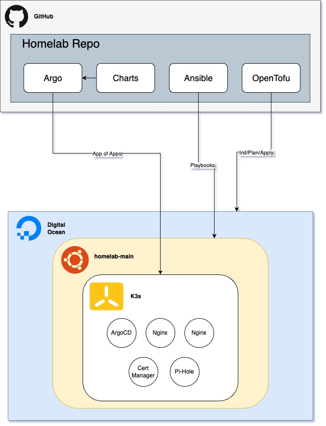

# Homelab Overview

## Description

In my homelab I utilize a range of tools for infrastructure provisioning, configuration management, and application deployment. OpenTofu (forked from Terraform) is used first to provision a DigitalOcean droplet, which serves as the host for the K3s Kubernetes cluster. Once the droplet is created, Ansible is employed to configure the server, setting up K3s and installing the necessary dependencies to ensure the server is ready for application deployments.

On the Kubernetes cluster, ArgoCD is used to implement GitOps for continuous delivery. ArgoCD syncs with this Git repository to automatically deploy changes to the cluster. Helm charts are used to manage and deploy applications on the K3s cluster, with ArgoCD handling the deployment and updates of these charts based on the configurations stored in Git. This setup ensures a fully automated and efficient workflow for managing infrastructure and application deployments in the homelab environment.
